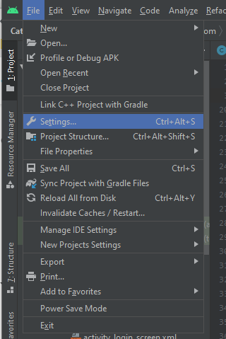
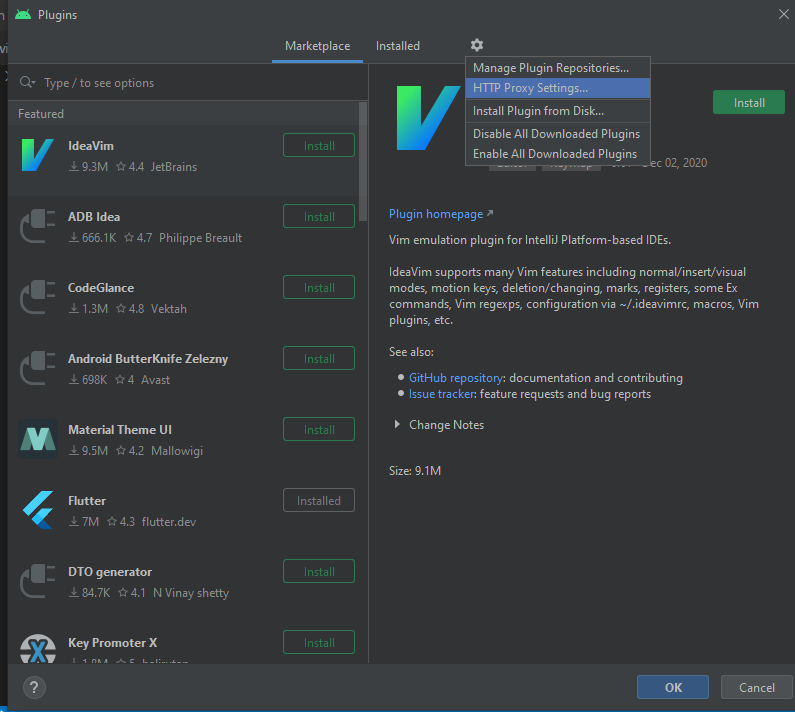

# Getting Started

This will show how to download Google Flutter on your computer. There is a step-by-step tutorial that is on the Google Flutter website linked [here](https://flutter.dev/docs/get-started/install). Each step on the website is described below.

### Install

Select the operating system of your computer and follow the instructions.

### Set up an editor

If you don't have Android Studio installed, you can install the latest version [here](https://developer.android.com/studio).

Once you have Android Studio installed, you need to install the Flutter and Dart plugins in Android Studio.
To do that, click the Configure and then Plugins on the main screen:

Alternatively, if you already have a project open you can access it by going to File > Settings > Plugins:

After doing that you should see Plugins appear when you select the Marketplace tab.

If you don't, you may need to turn on Auto-detect proxy settings.
To do this, go to the settings gear and click HTTP Proxy Settings...

Then select Auto-detect proxy settings, check the checkbox, and put this link in the text box: https://plugins.jetbrains.com/

Then click OK.

To find Flutter in the Marketplace, type it in the search bar and select it from the side menu.
Click Install. When it prompts, click Install to install Dart as well and then follow the instructions.

### More

Flutter should now be installed on your computer along with the plugin for Android Studio. If you want to test Flutter or gain more familiarity with it, you can follow the [Test Drive](https://flutter.dev/docs/get-started/test-drive) and [Write Your First App](https://flutter.dev/docs/get-started/codelab) tutorials on the Flutter page using the links provided.