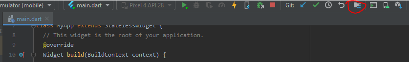
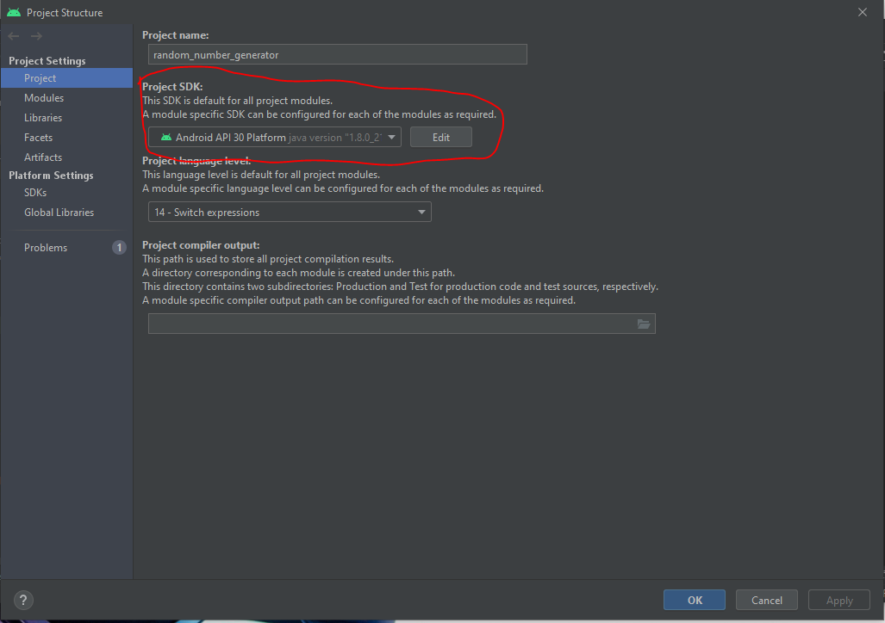
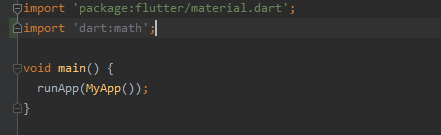

# Step by step instructions

## Make sure Project SDK is set
One of the first things you will want to do is check to make sure that the Project SDK is set so that it can be run on an emulator.  
To do this, click the project structure button and the top:  
   
Then, make sure an SDK is selected:   

## Create a layout

## Add logic for the button
First, import 'dart:math' to generate random numbers:   
   
Next, create a random number function:   

## Change title and theme
To do this, you will need to change certain aspects under Widget build(BuildContext context) function.   
   
Further explanation:   
title is the name of the app   
primarySwatch changes the theme color   
the title attribute in home: MyHomePage is the name that's displayed on the top of the screen

## Run the app

## Hot reload