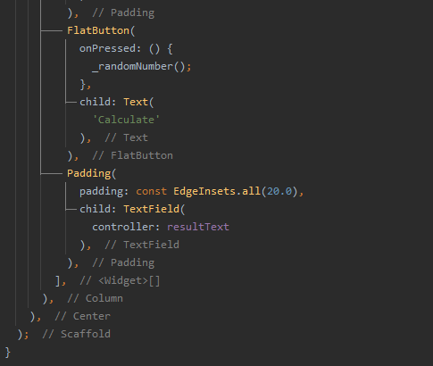
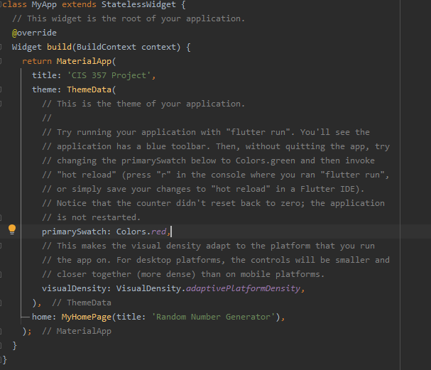

# Step by step instructions

## Make sure Project SDK is set
One of the first things you will want to do is check to make sure that the Project SDK is set so that it can be run on an emulator.  
To do this, click the project structure button and the top:  
   
Then, make sure an SDK is selected:   

## Create a layout
The code for the entire layout is this:    
   
   
This is under the Widget build (BuildContext context){} method.   
It's put into a column, which is center alligned.   
Other elements:
* children is everything that goes within the column
* Text is similar to a TextView in Android Studio
* TextField is like the TextField in Android Studio
* A FlatButton is a button   
More about the TextFields:   
* The controller is what allows the text in the text field to be accessed in another function
* The Padding can be added after the TextField is created by clicking on TextFiled, pressing Alt + Enter (Option + Return on Mac) and selecting 'wrap in padding'   

## Add logic for the button
First, import 'dart:math' to generate random numbers:   
    
Next, add the controllers from the text fields so the values can be grabbed:   
    
Next, create a random number function:   
    
The comments should help explain but here's a rundown:   
* First create a new instance of Random()   
* Grab the string values from the low and high text fields using the controllers   
* Convert the string values to int values and put it in a try block   
* Compute the result from random   
* Set that result to a string   
* Otherwise, if non-numeric values are entered, catch a FormatException   

## Change title and theme
To do this, you will need to change certain aspects under Widget build(BuildContext context) function.   
   
Further explanation:   
title is the name of the app   
primarySwatch changes the theme color   
the title attribute in home: MyHomePage is the name that's displayed on the top of the screen

## Run the app

## Hot reload
Video will be here