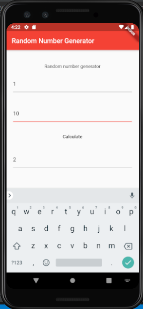

# Overview

This is a tutorial for Google Flutter. Google Flutter can be used on VSCode, IntelliJ, or Android Studio; however, this tutorial will cover Android Studio.

## What is Google Flutter?

According to the flutter.dev website, Google Flutter is for building apps that can run on Android, iOS, desktop, or the web, all from the same program. These apps are natively compiled within either Android Studio, IntelliJ, or VSCode. The code is written in .dart files

## Demo App

The app written to demonstarte these features is a random number generator. The app is in this github repository and a link can be found [here](https://github.com/abbybowerman/CIS357-Google-Flutter-Project). It takes a low input and a high input in text boxes and then calculates a random number when the button is clicked.   
   
Screenshot of the app:   
